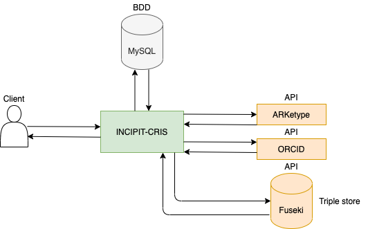

# INCIPIT-CRIS

## INCIPIT-CRIS

INCIPIT-CRIS is a project developed at the HEG of Geneva. The purpose is to develop a Current Research Information System (CRIS) based on a triplestore and using ARKs to identify the different ressources that use ARKetype, a swiss option for creating Archival Resource Keys (ARKs).

Interaction scheme :



## Fuseki

Fuseki is used as a standalone server. It is already configured to use one graph and an OWL reasoner.
User/Password are available in the file `fuseki/run/shiro.ini`.

## How tu run

Actually the shell script INCIPIT-CRIS_launcher.sh launch fuseki and django on the port 8000. Make sure to execute the script being in the folder and that it has the permissions to be run. Simply enter 

```bash
./INCIPIT-CRIS_launcher.sh
```

in the terminal and enjoy !